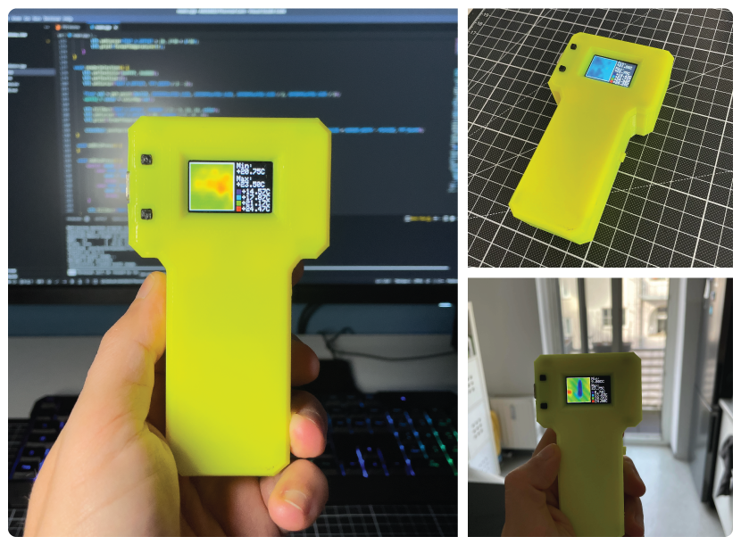
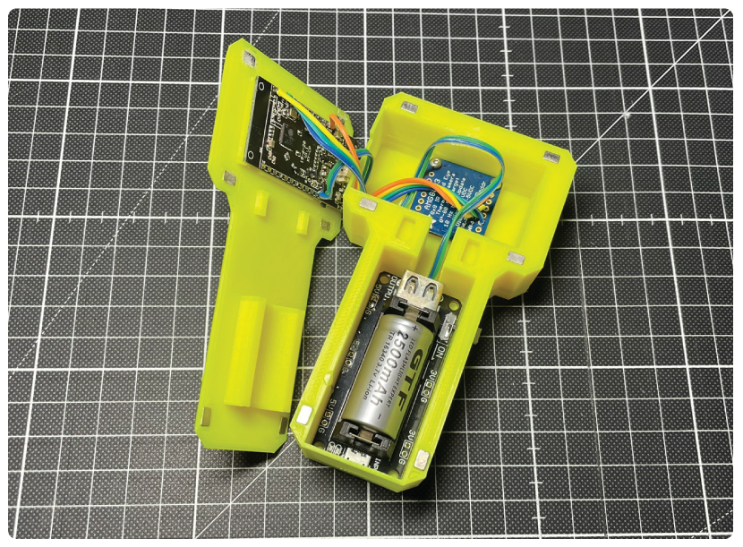

# AMG8833-Thermal-Cam

A simple thermal camera for ESP32 TTGO T-Display module using AMG8833 sensor based on [smartynov](https://github.com/smartynov's) [ir-cam code](https://github.com/smartynov/AMG8833-Thermal-Cam)

## Releases

For pre-built firmware binaries check the release assets: https://github.com/entrusc/AMG8833-Thermal-Cam/releases

## Parts List

* [ESP32 TTGO T-Display](https://www.lilygo.cc/products/lilygo%C2%AE-ttgo-t-display-1-14-inch-lcd-esp32-control-board)
* AMG8833 8x8 ir-sensor (e.g. from [Adafruit](https://www.adafruit.com/product/3538))
* 16340 lithium battery holder (like e.g. [this one](https://aliexpress.com/item/32955019430.html))
* a 16340 lithum battery
* some wires & soldering iron
* optional: 3d printed case ([STL files on printables.com](https://www.printables.com/model/658974-cheap-ir-cam))

This is a **fork** that incorporates the following changes:
* temperatures are now formatted in a more readable way, and temperatures out of range are marked accordingly
* added a "selection" mode to make it easier to read the temperature of the central point of the sensor (switch modes using button2)
* incorporated fix for negative temperature bug in AMG8833 library

Inspired by (and partially uses code from) examples from https://github.com/adafruit/Adafruit_AMG88xx and https://github.com/sparkfun/SparkFun_GridEYE_Arduino_Library

Original can be found here: https://github.com/smartynov/AMG8833-Thermal-Cam
